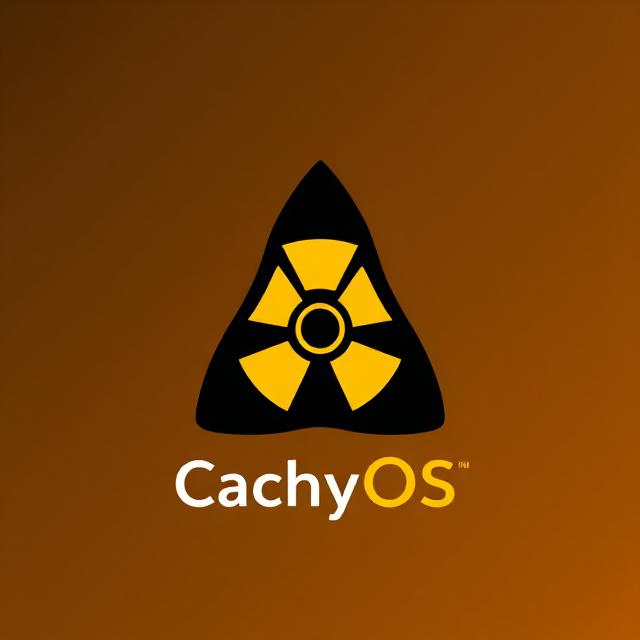

<div align="center">
	<a href="https://arkanelinux.org" align="center">
		<center align="center">
			<picture>
			 	
			</picture>
		</center>
	</a>
	<br>
	<h1 align="center"><center>Arkdep</center></h1>
</div>

<hr>

## AtomicArch

<div align="center">
	<p style="text-align: center;">
 	    
	</p>
</div>
<div style="text-align: left;">		    

AtomicArch is a customized Arkane Linux image and is only useful if you've already installed Arkane Linux -- an immutable version of Arch Linux. For more on Arkane and documentation refer to the [Arkane Linux Arkdep Documentation](https://docs.arkanelinux.org/arkdep/arkdep-usage/). This repo is just a modified fork of [arkanelinux/arkdep](https://github.com/arkanelinux/arkdep).<br>

This customization was designed to emulate Bluefin-dx. In addition to the image, several scripts are provided.  

```init_system.sh``` with "atomicarch" as an argument can be used for the initial deployment of AtomicArch.  Once AtomicArch is deployed and you've rebooted, ```init2.sh``` can be used to add useful Flatpaks,
chezmoi, Brew etc.  ***These init scripts only have to be run once.***

Note: 
   - The ```arkdep-build.d/atomicarch/extensions/post_install.sh``` adds two AUR packages during image build: rstudio-desktop-bin and r-rjava.  
   - ```pacman.conf``` file enables the Arch testing 
repositories.
   - mirrors have been changed to US mirrors based on rate-mirrors

An ```update_system.sh``` script (use "atomicarch" as the argument) is provided to easily update your image on a regular basis.  After doing the build, it uses ```compare_pkgs.sh``` to report on package changes, additions, and deletions. It runs ```copy_cleanup_oneliner.sh``` to clean up your ```arkdep/target``` directory and copy the most recent .tar.zst file to ```arkdep/cache```.  It then deploys the new image and invokes ```flatpak update``` and ```brew update && brew upgrade.```

Probably the easiest way to use this repo is to fork it, clone your fork to your machine, make adjustments for your needs (especially the bottom of 
```arkdep/arkdep-build.d/atomicarch/package.list``` -- see below) and run the scripts locally.

<hr>

## CachyAtomic

<div align="center">
	<p style="text-align: center;">
 	    
	</p>
</div>
<div style="text-align: left;">		
	
If your cpu can take advantage of Znver4 (to find out, run ```/lib/ld-linux-x86-64.so.2 --help | grep supported``` on Arch-based systems), you can get everything AtomicArch
offers but with the advantage of CachyOS Znver4-optimized packages and kernel by installing CachyAtomic using the ```init_system.sh``` script with "cachyatomic" as an argument.

You can still run ```init2.sh```, and use ```update_system.sh``` (again using the "cachyatomic" argument) to update your system. 

See [https://wiki.cachyos.org/features/optimized_repos/](https://wiki.cachyos.org/features/optimized_repos/) for more information on the CachyOS repos.
</div>
<hr>

arkdep/arkdep-build.d/atomicarch/package.list changes:
```
# Atomic Arch (custom)
bat
base-devel
bc
chezmoi
duf
eza
fastfetch
fuse2
gcc-fortran
gnome-weather
gnome-clocks
gnome-tweaks
kmymoney
lftp
micro
python-colorama
python-numpy
python-pandas
python-pip
python-pipenv
python-prettytable
python-pyperclip
python-reportlab
python-suds
python-svglib
r
rclone
sqlitebrowser
tailscale
ttf-meslo-nerd
virt-manager
virt-viewer
```
arkdep-build.d/atomicarch/extensions/post_install.sh changes:

```
# Set list of AUR packages to install
aur_packages=('yay-bin' 'rstudio-desktop-bin' 'r-rjava')
```
arkdep-build.d/atomicarch/pacman.conf changes:
```
[core-testing]
Server = http://arch.mirror.constant.com/$repo/os/$arch


[core]
Server = http://arch.mirror.constant.com/$repo/os/$arch


[extra-testing]
Server = http://arch.mirror.constant.com/$repo/os/$arch


[extra]
Server = http://arch.mirror.constant.com/$repo/os/$arch


#[testing]
#Server = http://arch.mirror.constant.com/$repo/os/$arch


#[community-testing]
#Server = http://arch.mirror.constant.com/$repo/os/$arch


#[community]
#Server = http://arch.mirror.constant.com/$repo/os/$arch


# If you want to run 32 bit applications on your x86_64 system,
# enable the multilib repositories as required here.

[multilib-testing]
Server = http://arch.mirror.constant.com/$repo/os/$arch


[multilib]
Server = http://arch.mirror.constant.com/$repo/os/$arch

```
